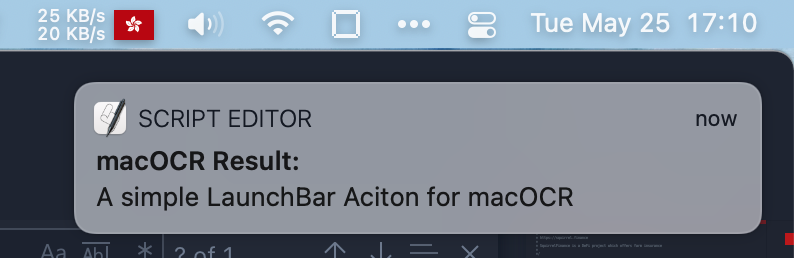

# macOCR LaunchBar Action
A simple LaunchBar Aciton for macOCR

## Demo 

## Dependency:

- [macOCR](https://github.com/schappim/macOCR)
- Screen Recording Authority

## About macOCR

macOCR is a command line app that enables you to turn any text on your screen into text on your clipboard. When you envoke the `ocr` command, a "screen capture" like cursor is shown. Any text within the bounds will be converted to text.